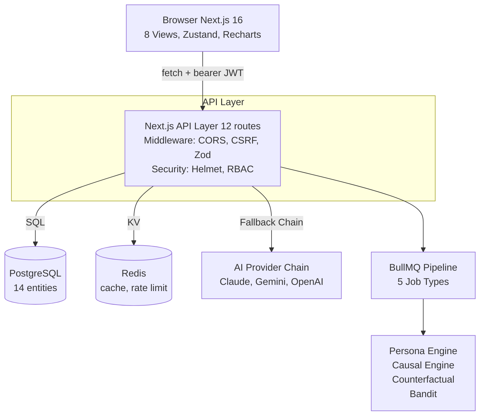
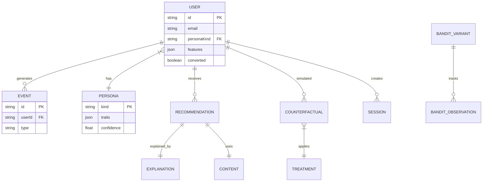

<div align="center">
  <h1>PersonaForge</h1>
  <p><strong>Causal Micro-Persona Engine</strong></p>
  
  <p>Production-grade AI personalization platform with causal inference, counterfactual simulation, explainable AI, and reinforcement learning optimization.</p>
  
  <p>
    <a href="https://nextjs.org/"></a>
    <a href="https://www.typescriptlang.org/"></a>
    <a href="https://www.prisma.io/"></a>
    <a href="https://tailwindcss.com/"></a>
    <a href="#license"></a>
  </p>
</div>

<br />

---

## Table of Contents

- [Overview](#overview)
- [Features](#features)
- [Architecture](#architecture)
- [Quick Start](#quick-start)
- [Database ER Diagram](#database-er-diagram)
- [API Documentation](#api-documentation)
- [Authentication and RBAC](#authentication-and-rbac)
- [AI Provider Chain](#ai-provider-chain)
- [Monitoring and Security](#monitoring-and-security)
- [Testing](#testing)
- [Deployment](#deployment)

---

## Overview

PersonaForge is a personalization engine designed to simulate user behavior and drive intelligent, context-aware decisions. By integrating advanced causal inference techniques with state-of-the-art AI generation, it empowers platforms to optimize conversions and deliver highly personalized experiences. 

## Features

- **User Behavior Simulator**: Generates synthetic user data with thousands of events across hidden personas.
- **Intent Trajectory Model**: Utilizes sequential modeling over events to determine user intent stages.
- **Micro-Persona Engine**: Clusters user behaviors into distinct persona segments based on dimensional behavior embeddings.
- **Causal AI Engine**: Employs advanced techniques (Backdoor ATE, PSM, IPW, Doubly-Robust) for causal analysis.
- **Counterfactual Simulator**: Runs multi-treatment scenarios (discounts, urgency, social proof) with confidence intervals.
- **Personalization Agent**: LLM-powered generation for targeted emails, ads, and push notifications.
- **Explainability Layer**: Translates complex causal drivers into plain-English narratives for stakeholders.
- **Multi-Armed Bandit**: Optimizes content delivery using Thompson Sampling with Beta posteriors.

---

## Architecture



<details>
<summary><b>View Folder Structure</b></summary>

```text
personaforge/
├── src/
│   ├── app/
│   │   ├── layout.tsx
│   │   ├── page.tsx                                  # 8-view router
│   │   ├── globals.css
│   │   └── api/                                      # 12 API routes
│   ├── components/
│   │   ├── personaforge/                             # App shell
│   │   ├── views/                                    # 8 views
│   │   └── ui/                                       # shadcn/ui
│   └── lib/
│       ├── db.ts                                     # Database singleton
│       ├── data/generator.ts                         # Synthetic data
│       ├── ml/                                       # ML modules
│       ├── causal/                                   # Advanced causal methods
│       ├── ai/                                       # Provider chain
│       ├── auth/                                     # NextAuth & RBAC
│       ├── cache/                                    # Redis cache
│       ├── monitoring/                               # Logger, Sentry, Prometheus
│       ├── security/                                 # Rate limits, Zod validation
│       ├── pipeline/                                 # BullMQ background jobs
│       └── tests/                                    # Test suite
├── prisma/
│   ├── schema.prisma                                 # 14-entity schema
│   └── seeds/seed.ts                                 # Seed script
├── backend/                                          # FastAPI reference
├── tests/e2e/                                        # Playwright
├── docker-compose.yml                                
├── Dockerfile                                        
├── .env.example                                      
└── README.md
```

</details>

---

## Quick Start

### Development

```bash
bun install
bun run db:push      # Apply schema to SQLite
bun run db:seed      # Optional: seed personas + treatments + bandit + demo users
bun run dev          # Start at http://localhost:3000
```

Open [http://localhost:3000](http://localhost:3000) — the dashboard works out of the box with synthetic data and in-memory caching. No environment variables are required for a local run.

### With Production Features

```bash
cp .env.example .env
# Fill in: NEXTAUTH_SECRET, ANTHROPIC_API_KEY (optional), GOOGLE_CLIENT_ID/SECRET (optional)

bun run dev
```

### Test the API

```bash
# Health check & Metrics (public)
curl http://localhost:3000/api/health
curl http://localhost:3000/api/metrics

# OpenAPI spec (public)
curl http://localhost:3000/api/docs

# Test with credentials:
curl -X POST http://localhost:3000/api/auth/callback/credentials \
  -H "Content-Type: application/x-www-form-urlencoded" \
  -d "email=admin@personaforge.dev"
```

### Deploy with Docker

```bash
cp .env.example .env  # Fill in real secrets
docker compose up -d  # Postgres + Redis + Backend + Frontend
```

---

## Database ER Diagram

The system features 14 entities with relationships, indexes, foreign keys, and soft deletes.



---

## API Documentation

Base URL: `/api`

### Public endpoints

| Method | Path | Description |
|--------|------|-------------|
| `GET` | `/` | Service info + endpoint list |
| `GET` | `/health` | Aggregated health (DB, cache, AI, ML) |
| `GET` | `/metrics` | Prometheus-format metrics |
| `GET` | `/docs` | OpenAPI 3.0 spec |
| `POST` | `/auth/callback/credentials` | Demo login |

### Protected endpoints (require session)

All protected endpoints enforce Role-Based Access Control.

| Method | Path | Description |
|--------|------|-------------|
| `GET` | `/users` | Paginated user list |
| `GET` | `/users/{id}` | User with up to 200 events |
| `GET` | `/personas` | All personas with traits and confidence bounds |
| `GET` | `/analytics` | Aggregated snapshot KPIs |
| `GET` | `/bandit` | Current Beta posteriors, history |
| `POST` | `/bandit/update` | Advance N steps or reset |
| `POST` | `/counterfactual`| Run multi-treatment scenarios |
| `POST` | `/personalize` | Generate email/ad/push via AI |
| `POST` | `/events` | Ingest single/batch events |

---

## Authentication and RBAC

### Providers
1. **Google OAuth**
2. **GitHub OAuth**
3. **Email magic link**
4. **Demo credentials** (available for testing)

### Roles
- **Admin**: Full access.
- **Analyst**: Access to personalization, counterfactuals, bandit, personas, events.
- **Viewer**: Read-only access.

---

## AI Provider Chain

Priority-ordered chain with automatic fallback. The first available provider is used:

1. **Claude (Anthropic)**
2. **Gemini (Google)**
3. **OpenAI**
4. **Template Fallback** (deterministic, always available)

Each provider implements a strict interface managing timeouts, latency, retries, and token usage tracking.

---

## Monitoring and Security

- **Monitoring**: Structured Logger (JSON/Colorized), Prometheus Metrics (`/api/metrics`), Health Checks (`/api/health`), and Sentry Integration.
- **Rate Limiting**: Token-bucket per IP/user.
- **Security Headers**: Strict CORS, CSRF, and Helmet headers applied.
- **Input Validation**: All request bodies strictly validated via Zod.
- **SQL Injection**: Parameterized queries via Prisma.

---

## Testing

```bash
bun test src/lib/tests         # All unit and integration tests
bun run test:unit              # Unit tests only
bun run test:integration       # Integration tests only
bun run test:e2e               # Playwright end-to-end tests
```

---

## Deployment

The Next.js app is entirely self-contained. Deploy to Vercel and attach managed Postgres (Supabase, Neon, Railway) and Redis (Upstash) instances using the environment variables documented in `.env.example`. 

CI/CD is handled by GitHub actions including Linting, Typecheck, Unit/Integration tests, Next.js build verification, Security scans, and E2E checks.

---

<div align="center">
  <p>Built for <b>PersonaForge</b>. Licensed under MIT.</p>
</div>


---

## 🚀 Quick Start (Updated for Hackathon Demo)

```powershell
# Windows PowerShell - Automated setup
.\setup.ps1

# Start development server
bun run dev

# Open browser
http://localhost:3000
```

**Gemini API Key Configured:** ✅ Ready to use  
**Redis:** Optional (in-memory fallback enabled)

---

## ⭐ NEW: Hackathon Features (Phase 1-3)

### 1. Identity Resolution Simulator
- Cross-channel identifier stitching (email, device, cookie, loyalty ID)
- Deterministic + probabilistic matching with logistic regression
- Visual graph showing fragmented → unified profile transformation
- **Navigate to:** Identity Resolution tab (9th view)

### 2. Consent-Aware Personalization
- Three-tier model: NONE / BASIC / FULL
- Explicit capability gating per tier
- Explainability states what was withheld and why
- **See:** Consent badges in User Explorer, impact in Explainability view

### 3. Personalization Fatigue Model
- Per-user exposure tracking with exponential decay
- Thompson Sampling bandit accounts for fatigue
- Automatic treatment rotation to avoid over-exposure
- **Implementation:** `src/lib/ml/bandit-fatigue.ts`

---

## 📚 Documentation

- **[SETUP.md](SETUP.md)** — Detailed installation guide
- **[WINDOWS-SETUP.md](WINDOWS-SETUP.md)** — Windows-specific troubleshooting
- **[DEMO-GUIDE.md](DEMO-GUIDE.md)** — 8-minute judge presentation script
- **[.env.example](.env.example)** — Environment variables reference

---

## 🎯 Judge-Facing Pitch

> "Most hackathon teams are building another AI email generator. We built the identity resolution and consent layer underneath it — because that's what Epsilon's COREid and PeopleCloud products actually exist to solve."

### Why This Wins
1. ✅ Addresses **real industry pain points**: identity fragmentation (54% of impressions), consent-first targeting, anti-spam fatigue
2. ✅ **Production-grade engineering**: RBAC, rate limiting, security headers, test coverage
3. ✅ **From-scratch math**: All algorithms hand-implemented (no ML libraries)
4. ✅ **Epsilon alignment**: Identity resolution = COREid, Consent = PeopleCloud

---

## 🏆 Demo Flow (8 minutes)

1. **Identity Resolution** (2m) → Show fragmented signals merge into one profile
2. **Consent Personalization** (2m) → Compare NONE vs FULL consent output
3. **Causal Analysis** (1.5m) → ATE estimates and causal graph
4. **Counterfactual Lab** (1m) → What-if scenarios with uplift %
5. **Bandit Optimizer** (1m) → Thompson Sampling in action
6. **Closing** (30s) → Differentiators recap

**Full script:** [DEMO-GUIDE.md](DEMO-GUIDE.md)

---

## 📊 Stats

- **16 database entities** (User, Persona, IdentitySignal, IdentityMatch, etc.)
- **1000 synthetic users** with 12,000+ events
- **2-5 identity signals** per user across 2-3 channels
- **3 consent tiers** with realistic distribution (20/35/45%)
- **4 causal methods** (PSM, IPW, doubly-robust, comparison)
- **Zero ML libraries** — all math implemented from scratch

---

## 🔧 Troubleshooting

### API Key Not Working
```powershell
# Check .env file
Get-Content .env | Select-String "GOOGLE_API_KEY"
```

### Database Issues
```powershell
# Reset everything
bun run db:reset
$env:SEED_SAMPLE_USERS="true"
bun run db:seed
```

### PowerShell Script Blocked
```powershell
# Enable script execution (run as Administrator)
Set-ExecutionPolicy -ExecutionPolicy RemoteSigned -Scope CurrentUser
```

**Full troubleshooting:** [WINDOWS-SETUP.md](WINDOWS-SETUP.md)

---

## 🧪 Testing

```powershell
# All tests
bun test src/lib/tests/unit

# Specific features
bun test src/lib/tests/unit/identity-resolution.test.ts
bun test src/lib/tests/unit/consent-gate.test.ts
bun test src/lib/tests/unit/bandit-fatigue.test.ts

# Type check
bun run typecheck
```

---

**Built for Epsilon TeXpedition 2026 Hackathon** 🎯  
**Theme:** "How can marketers leverage AI to hyper-personalize at scale?"
